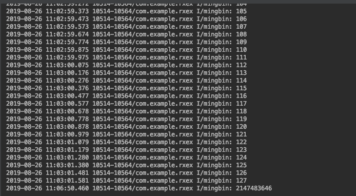

# 播种网android编码规范

### 1. 资源文件需带模块前缀.

### 2. layout文件的命名方式.

* Activity 的 layout 以 module\_activity 开头
* Fragment 的 layout 以 module\_fragment 开头
* Dialog 的 layout 以 module\_dialog 开头
* include 的 layout 以 module\_include 开头
* ListView, RecyclerView,GridView 的 layout 以 module\_item 开头

### 3. drawable 资源名称由设计命名，根据分辨率不同存放在 不同的 drawable 目录下，如果介意包大小建议只使用一套，系统去进行缩放。

其中selector,  shape 等功能性资源文件由其特性功能名开头以便复用: 

```text
selector_module_tabs.xml
shape_module_tabs_normal.xml
shape_module_tabs_pressed.xml
```

### 4. anim 资源名称以小写单词+下划线的方式命名，采用以下规则：

* 逻辑名称\_\[方向\|序号\]

Tween 动画（使用简单图像变换的动画，例如缩放、平移）资源：尽可能以通用的 动画名称命名，如 fade\_in , fade\_out , push\_down\_in \(动 画+方向\)。 Frame 动画（按帧顺序播放图像的动画）资源：尽可能以功能命名+序号。如 loading\_grey\_001。

### 5. style 资源采用“父 style 名称.当前 style 名称”方式命名，写入 module\_styles.xml 文件中，首字母大写。如：

```text
<style name="ParentTheme.ThisActivityTheme">
 …
</style>
```

### 6. Id 资源原则上用下划线分割，View 组件的资源 id 建议以 View 的缩写作为 前缀。常用缩写表如下：



其它控件的缩写推荐使用小写字母并用下划线进行分割，例如：ProgressBar 对应 的缩写为 progress\_bar；DatePicker 对应的缩写为 date\_picker。

### 7. 图片根据其分辨率，放在不同屏幕密度的 drawable 目录下管理，否则可能 在低密度设备上导致内存占用增加，又可能在高密度设备上导致图片显示不够清晰。

说明： 为了支持多种屏幕尺寸和密度，Android 提供了多种通用屏幕密度来适配。常用的 如下。

```text
ldpi - 120dpi
mdpi - 160dpi
hdpi - 240dpi
xhdpi - 320dpi
xxhdpi - 480dpi
xxxhdpi - 640dpi 
```

Android 的屏幕分辨率和密度并不存在严格的对应关系，应尽量避免直接基于分辨 率来开发，而是通过适配不同的屏幕密度来保证控件和图片的显示效果。不同密度 drawable 目录中的图片分辨率设置，参考不同密度的 dpi 比例关系。


